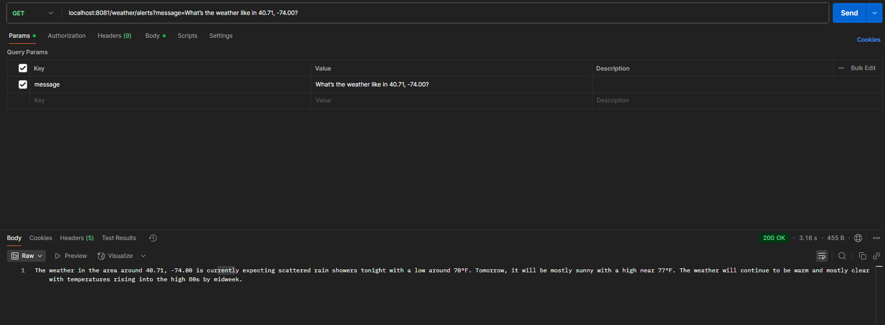
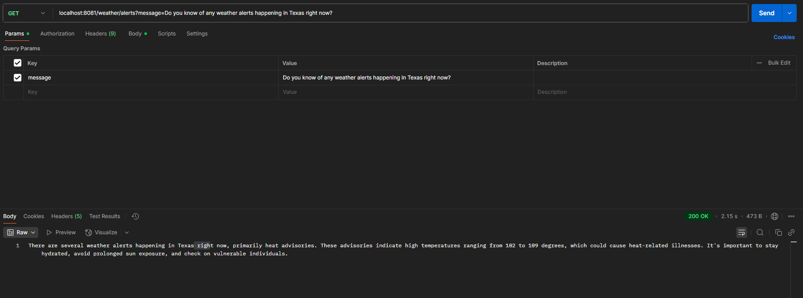

# AI Weather Tool

AI Weather Tool is a portfolio project built with Spring Boot, Spring AI, and OpenAI. It combines natural-language weather requests with backend weather tools and a simple responsive frontend.

## Overview

This project was built to demonstrate:
- AI-powered prompt handling with Spring AI
- weather-focused REST API integration
- a clean frontend weather interface
- beginner-friendly project structure that can be extended later

## Features

- Natural-language weather requests
- Forecast support for coordinate-based queries
- Active weather alerts by U.S. state
- Frontend weather UI with city search and forecast cards
- Loading and error states in the interface
- Portfolio-ready layout for desktop and mobile

## Tech Stack

- Java
- Spring Boot
- Spring AI
- OpenAI API
- REST APIs
- HTML
- CSS
- JavaScript
- Maven
- JSON

## How It Works

1. A user enters a weather-related prompt.
2. Spring AI processes the request using `ChatClient`.
3. Tool-calling routes the request to weather functions.
4. The app returns forecast or alert information to the UI.

## Run Locally

### 1. Clone the repository

```bash
git clone https://github.com/Rabbi-1/Ai-Weather-Tool.git
cd AiWeatherTool
```

### 2. Set your OpenAI API key

PowerShell:

```powershell
$env:OPENAI_API_KEY="your-api-key-here"
```

The application reads:

```properties
spring.ai.openai.api-key=${OPENAI_API_KEY}
```

### 3. Start the app

```powershell
.\mvnw.cmd spring-boot:run
```

### 4. Open the project

```text
http://localhost:8081
```

## Notes

- Use a valid OpenAI API key before starting the app.
- If you change the key, restart the app in the same terminal session.
- The frontend can be connected to a live weather API later if you want a pure client-side version.

## Screenshots

Forecast example:



Alert example:




